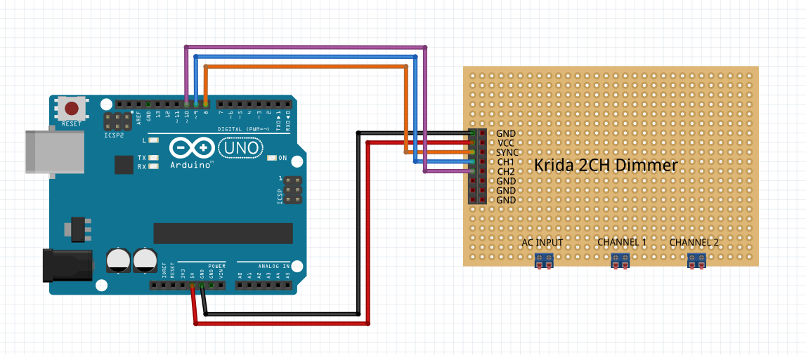

# TriacDimmer
An arduino library for controlling a triac dimmer.

This library was designed to perform phase-control dimming control on a triac dimming circuit,
  leveraging the ATmega328p's built-in timer peripheral to perform all time-critical functionality directly in hardware,
  without the need to spend CPU time on an expensive control loop.

Note that this library is intended to control mains AC power.
Make sure you understand the risks and take appropriate precautions before working with mains AC.

The phase offsets are calculated based on the _measured_ mains frequency,
  so this code will work regardless of 50/60Hz or any other frequency.
This includes correcting for any inaccuracies in the arduino's oscillator or the mains frequency.

This library was developed specifically for the Krida 2 CH Dimmer
  ([amazon](https://www.amazon.com/Dimmer-Module-Controller-Arduino-Raspberry/dp/B06Y1GVG26),
  [alibaba](https://mdwdz.en.alibaba.com/product/60670737878-804998378/2CH_AC_LED_Light_Dimmer_Module_Controller_Board.html),
  [inmojo](http://www.inmojo.com/store/krida-electronics/item/2-channel-ac-led-bulb-dimmer-module-v2/)),
  and has been tested to work with the RobotDyn AC Dimmer
  ([robotdyn](https://robotdyn.com/ac-light-dimmer-module-1-channel-3-3v-5v-logic-ac-50-60hz-220v-110v.html)),
  and should work fine with other phase-control dimming circuits that output a positive edge on their sync signal.

See [the example](examples/basic_example/basic_example.ino) for an example of how to use the library.
The library methods themselves are documented in [the library header](src/TriacDimmer.h).

This library **requires** the use of certain pins.
Pin 8 _must_ be used as the sync input, and pins 9 and 10 are the only pins that can be used as channel outputs.
This library _will not work_ on any other pins, period.



## Flickering, and How to Fix It

If you experience issues with flickering, there are a handful of parameters you can pass to `begin` that can be adjusted depending on what sort of flickering you have.
By default, with no arguments the library uses these values as defaults:

```cpp
TriacDimmer::begin(pulse_length = 20, min_trigger = 2000, on_thresh = 2, off_thresh = 0.01)
```

First off, if you experience flickering regardless of the brightness value you set, increase `pulse_length` from the default `20` to a larger value like `50` or `100` until `TriacDimmer::setBrightness(pin, 0.5);` results in a stable glow.

Once it's stable at 0.5, set the brightness 1.0 (`TriacDimmer::setBrightness(pin, 1.0);`) and check for flickering.
There shouldn't be any, but if there is you can increase `min_trigger` from the default `2000` to perhaps `3000` or `4000` until the flickering stops.
If you're still experiencing flickering no matter how large `min_trigger` is, you can also try setting `on_thresh` to below the highest brightness level that causes flickering. This shouldn't normally be necessary though, as adjusting `min_trigger` should normally be enough.

The last step is to figure out the lowest brightness value can sustain without flickering. 
By default the library is set to cut off completely for brightness values smaller than `0.01`, but if you still see flickering at `0.015` or `0.02` you can try setting `off_thresh` to a value that's larger than that.

If you've tried all of these steps and you still get flickering, consider opening an issue.
Make sure to include as much information about your setup as you can, including the specific dimmer board you're using.
Also, if you have access to an oscilliscope, screenshots are always helpful in trying to diagnose flickering.
